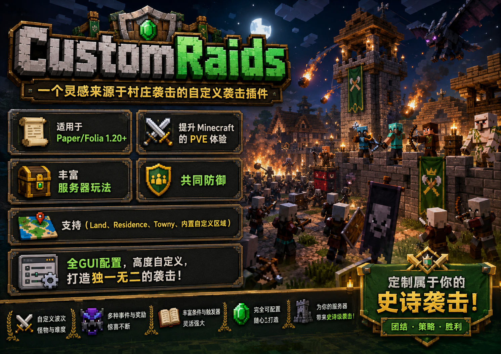
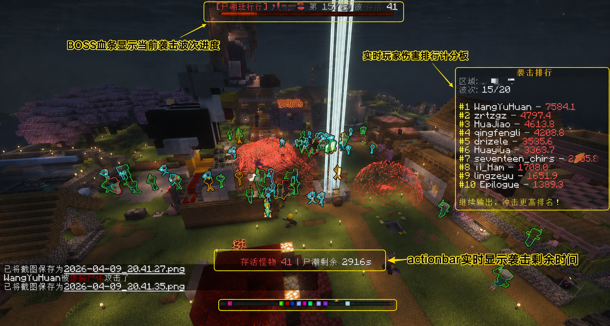
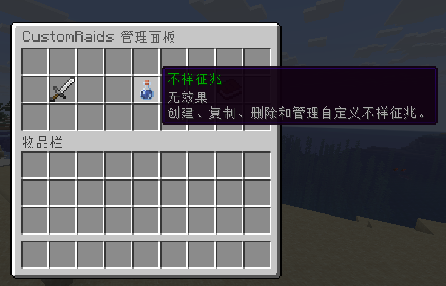

# CustomRaids

**English** | [简体中文](README.zh-CN.md)

## 1. Overview

> **CustomRaids** is a customizable raid plugin inspired by Minecraft village raids.
>
> Built for **Paper and Folia 1.20+ servers**, CustomRaids enhances the Minecraft PvE experience with cooperative battles. Players can defend **Lands, Residence, Towny, or built-in custom regions**, defeat waves of monsters, and earn raid rewards.
>
> Raids and Bad Omen effects can be configured entirely through in-game GUIs. Display messages are fully customizable, allowing you to create a unique raid experience for your server.

## 2. Trailer

[Watch the CustomRaids trailer on YouTube](https://www.bilibili.com/video/BV1qxREBSEE9/)

## 3. Screenshots

> A live test on a public server where more than 30 players defended against 20 waves of monsters with excellent performance.

> Raids and Bad Omen effects can be created quickly through the in-game menu. Run `/raids gui` to open the management menu.

## 4. Core Features

1. Raid support for **Lands, Residence, Towny, and custom regions**.
2. **Complete GUI configuration** with no manual configuration-file editing required.
3. Multiple raid phases: **preparation, countdown, and battle**.
4. A wide variety of raid mechanics, with additional features available in the Premium Edition.
5. **Custom Bad Omen effects**.
6. Highly customizable **chat messages, action bars, titles, and sounds**.
7. Custom Bad Omen effects as **MythicMobs** drops: `customraidsomen{omen=<id>;level=<n>}`.
8. **Custom rewards, live scoreboard rankings, and damage rankings**.
9. **Built-in custom regions**, so a separate region plugin is optional.
10. **Scheduled weekly raid events** in the Premium Edition.

## 5. Requirements

- **Server software:** Paper or Folia 1.20+
- **Java:** Java 21
- **Required dependency:** MythicMobs
- **Required on Folia:** ProtocolLib
- **Supported region systems:** Lands / Residence / Towny / built-in custom regions

## 6. Folia Support

> Install **ProtocolLib** on Folia servers to enable the complete sidebar scoreboard display.

## 7. Pricing

- **Free Edition:** Create up to **3 standard raids**.
- **Premium Edition:**
  1. Unlock every plugin feature.
  2. Access the customer support group.
  3. Receive faster plugin assistance.
  4. Receive priority responses to feature suggestions.

**Price: CNY 30** ~~(CNY 99)~~ ~~(launch offer)~~ (The price will increase with the next major update.)

[Purchase CustomRaids](https://ifdian.net/a/yyyork)

## 8. Download

[Download CustomRaids](https://www.yuque.com/u28211816/kcbkk5/tkt9k1wnv4k97ah9)

## 9. Bug Reports

Please report bugs through [GitHub Issues](https://github.com/DuckLee95/CustomRaids/issues). Include your server software, Minecraft version, plugin version, relevant logs, and steps to reproduce the problem.

## 10. Community Links

- [MineBBS](https://www.minebbs.com/resources/customraids-residence-land.16339/)
- [HiMCBBS](https://www.himcbbs.com/resources/1480/)
- [KLPBBS](https://klpbbs.com/thread-171007-1-1.html)
- [Bilibili](https://www.bilibili.com/video/BV1qxREBSEE9/)
