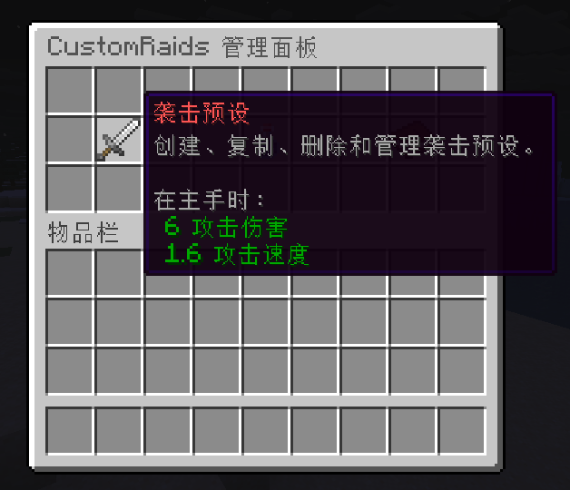

# 袭击配置教程

## 使用游戏内 GUI 编辑



使用 `/raids gui` 打开游戏内管理菜单，快速创建袭击。

## 使用配置文件编辑

### 文件位置

袭击预设是 `plugins/CustomRaids/raids/` 下的 YAML 文件。

内置示例来自 `src/main/resources/raids/`。

### 顶层结构

```yaml
# 袭击预设名
name: example_raid

# 袭击类型；支持 WAVE_RAID（波次型）和 CHALLENGE_RAID（区域挑战型）
# 此字段可省略，默认为 WAVE_RAID
type: WAVE_RAID

# type 的可选兼容别名，也可使用 raid-type 或 mode
# 实际配置时通常只需保留 type
raid_type: WAVE_RAID

# 全局配置，必须存在
global: {}

# 生命周期 hook 配置
hooks: {}

# BossBar、ActionBar、排行、计分板和标题配置
display: {}

# 参与及排名奖励配置
rewards: {}

# 波次型袭击的波次列表
# WAVE_RAID 必须包含至少一个有效条目
waves: []

# 区域挑战型袭击配置
# CHALLENGE_RAID 必须包含至少一个有效的 challenge.mobs 条目
challenge: {}
```

如果没有波次列表但存在 `challenge.mobs`，解析器会将预设作为挑战袭击处理。

### global 配置
```yaml
global:
  # 袭击期间临时设置到区域的 flag
  # 常见 flag 包括 monsters、explode、pvp，实际效果取决于区域提供器
  temp_flags: {}

  # 临时区域 flag 的持续时间，单位为 tick
  temp_flags_ttl_ticks: 2400

  # 每个波次开始前的默认准备时间，单位为秒
  prepare_between_seconds: 10

  # 整场袭击的时间限制，单位为秒
  # 波次型袭击中填写 0 表示不限时
  time_limit_seconds: 0

  failures:
    # 区域内持续无人达到此秒数后判定袭击失败
    # 填写 0 表示禁用；适用于所有袭击类型
    fail_after_empty_seconds: 0

    # 玩家总死亡次数达到此值后判定袭击失败
    # 填写 0 表示禁用；适用于所有袭击类型
    max_deaths: 0

  mob_glow:
    # 是否周期性使场上的袭击怪物发光
    enabled: false

    # 发光效果的刷新周期，单位为秒
    interval_seconds: 8

    # 每次发光效果的持续时间，单位为秒
    duration_seconds: 5

  spawn:
    # 波次刷怪点生成策略
    # random_in_region：在区域内随机生成
    # near_players：在玩家附近生成
    # ring：按指定半径环绕生成
    strategy: random_in_region

    # 为每个刷怪点寻找合法位置时的最大尝试次数
    tries_per_point: 60

    # 各计划刷怪点之间的最小距离
    min_dist_between: 3.0

    # 波次刷怪点与玩家之间的最小距离
    min_dist_from_players: 6.0

    # 是否将刷怪位置对齐到方块中心
    center_on_block: true

    # ring 策略使用的环绕半径
    ring_radius: 10.0

    # 是否检查区块加载、区域边界、脚下方块、头部空间、流体和危险方块
    # 兼容别名为 check_safe_block
    safe_check: true
```

失败条件兼容旧键名 `empty_region_seconds`、`empty_seconds` 和 `death_limit`。

挑战袭击不使用上述波次刷怪策略，而是通过 `SpawnPointPlanner.pickAroundPlayers`，根据挑战距离配置围绕仍在区域内的玩家动态寻找合适刷怪点。

### hooks 配置

```yaml
hooks:
  # 袭击开始时执行
  start:
    scope: server
    chat: "&a[Example] Raid started in &f%region%&a."
    sound: { id: "minecraft:raid.horn", volume: 1.0, pitch: 1.0 }

  # 波次清理完成时执行
  wave_cleared:
    scope: region
    chat: "&a[Example] Wave %wave%/%waves% cleared."
    sound: { id: "minecraft:entity.player.levelup", volume: 1.0, pitch: 1.1 }

  # 袭击胜利时执行
  victory:
    scope: server
    chat: "&a[Example] %region% survived all waves."
    sound: { id: "minecraft:ui.toast.challenge_complete", volume: 1.0, pitch: 1.0 }

  # 袭击失败时执行，也是具体失败原因未配置时的回退 hook
  defeat:
    scope: server
    chat: "&c[Example] %region% raid failed."
    sound: { id: "minecraft:entity.wither.death", volume: 1.0, pitch: 0.9 }

  # 区域持续无人导致失败时执行
  defeat_empty_region:
    scope: server
    chat: "&c[Example] %region% raid failed because all players left for %fail_after_empty_seconds%s."
    sound: { id: "minecraft:entity.wither.death", volume: 1.0, pitch: 0.9 }

  # 袭击超时导致失败时执行
  defeat_timeout:
    scope: server
    chat: "&c[Example] %region% raid timed out."
    sound: { id: "minecraft:entity.wither.death", volume: 1.0, pitch: 0.9 }

  # 玩家总死亡次数达到上限导致失败时执行
  defeat_max_deaths:
    scope: server
    chat: "&c[Example] %region% raid failed because deaths reached %total_deaths%/%max_deaths%."
    sound: { id: "minecraft:entity.wither.death", volume: 1.0, pitch: 0.9 }
```

`defeat_empty_region`、`defeat_timeout` 和 `defeat_max_deaths` 适用于所有袭击类型。

兼容别名包括 `defeat_empty`、`defeat_leave`、`defeat_leave_region`、`defeat_time_limit`、`defeat_time`、`defeat_deaths` 和 `defeat_death_limit`。

### display 配置

```yaml
display:
  bossbar:
    # BossBar 颜色
    color: RED

    # BossBar 分段样式
    style: SEGMENTED_10

    # 倒计时阶段显示文本
    countdown_title: "&e%region% %countdown%s"

    # 袭击进行阶段显示文本
    in_progress_title: "&c%region% Alive: %alive%"

    # 波次准备阶段显示文本
    preparing_title: "&e%region%"

    # 袭击胜利时显示文本
    victory_title: "&a%region%"

    # 袭击失败时显示文本
    defeat_title: "&c%region%"

  actionbar:
    # 波次开始前的倒计时文本
    countdown: "&eWave %wave%/%waves% starts in %countdown%s"

    # 当前波次限时时的进行中文本
    in_progress_timed: "&cAlive %alive% | Wave left %remain%s"

    # 整场袭击限时时的进行中文本
    in_progress_raid_timed: "&cAlive %alive% | Raid left %remain%s"

    # 不限时时的进行中文本
    in_progress_unlimited: "&cAlive %alive%"

  ranking:
    # 伤害排行标题
    header: "&6Damage Ranking"

    # 每条排行记录的格式
    line: "&e#%rank% &f%player% &c%damage%"

    # 没有伤害记录时的文本
    empty: "&7No damage recorded."

    # 最多显示的排行条目数
    max_entries: 5

  scoreboard:
    # 是否启用计分板显示
    enabled: true

    # 计分板最多显示的条目数
    max_entries: 5

  titles:
    # 波次主标题前缀
    wave_title_prefix: "&eWave"

    # 波次副标题格式
    wave_subtitle: "&7%wave%/%waves%"
```

### rewards 配置

```yaml
rewards:
  # 发放给所有符合条件参与者的控制台命令
  participation_commands:
    - "say %player% participated"

  # 分别发放给伤害排行第一、第二和第三名的控制台命令
  top1_commands:
    - "say TOP1 %player%"
  top2_commands:
    - "say TOP2 %player%"
  top3_commands:
    - "say TOP3 %player%"
```

`rewards.commands` 是旧版参与奖励命令列表的兼容键。前三名奖励按伤害排行发放。

常见奖励占位符：

- `%player%`
- `%rank%`
- `%damage%`
- `%region%`
- `%preset%`
- `%participants%`
- 失败相关：
  - `%defeat_reason%`
  - `%defeat_reason_raw%`
  - `%fail_after_empty_seconds%`
  - `%empty_seconds%`
  - `%time_limit%`
  - `%total_deaths%`
  - `%max_deaths%`
- 挑战袭击相关：
  - `%kills%`
  - `%deaths%`
  - `%total_kills%`
  - `%target_kills%`
  - `%phase%`
  - `%phase_raw%`

`%phase%` 使用 `raid.display.challenge.phase.*` 语言键；`%phase_raw%` 保留稳定的原始键。

### 波次型袭击（WAVE_RAID）

```yaml
# 使用波次型袭击
type: WAVE_RAID

waves:
  # 每个列表条目代表一个波次
  - # 当前波次的标题
    title: "&eWave 1"

    # 当前波次开始前的准备时间，单位为秒
    # 未配置时使用 global.prepare_between_seconds
    prepare_seconds: 5

    # 当前波次的时间限制，单位为秒；填写 0 表示不限时
    time_limit_seconds: 0

    sound:
      # 当前波次开始时播放的声音资源 id
      id: "minecraft:raid.horn"

      # 声音音量
      volume: 1.0

      # 声音音调
      pitch: 1.0

    mobs:
      # id：MythicMobs 怪物 id
      # count：当前波次生成的整数数量
      - { id: EX_Walker, count: 6 }
      - { id: EX_Thrower, count: 2 }
```

当前波所有已追踪怪物不再存活时，该波被视为清理完成。

### 区域挑战型袭击（CHALLENGE_RAID）

> 此功能为进阶版专属。

```yaml
# 使用区域挑战型袭击
type: CHALLENGE_RAID

challenge:
  # 挑战总时间限制，单位为秒
  time_limit_seconds: 300

  # 进入胜利判定或 Boss 阶段所需的总击杀数
  target_kills: 60

  # 场上允许同时存活的普通袭击怪物数量上限
  max_alive_mobs: 18

  # 每轮计划生成的普通怪物数量
  spawn_count_per_round: 5

  # 两轮刷怪之间的间隔，单位为秒
  spawn_period_seconds: 5

  # 刷怪点与区域内玩家之间的最小距离
  min_spawn_distance: 8.0

  # 刷怪点与区域内玩家之间的最大距离
  max_spawn_distance: 24.0

  # 是否在挑战期间禁用 PvP
  pvp_disabled: true

  # 是否阻止区域内生成原版怪物
  block_vanilla_mobs: true

  # 玩家死亡时是否保留物品栏
  keep_inventory_on_death: false

  # 玩家死亡时是否保留经验
  keep_experience_on_death: false

  # 挑战结束时是否清理仍存活的袭击怪物
  cleanup_mobs_on_end: true

  mobs:
    # id：MythicMobs 怪物 id
    # probability：被选中的相对权重
    # 权重键也可使用 chance、weight 或 count
    - { id: EX_Walker, probability: 0.62 }
    - { id: EX_Rusher, probability: 0.23 }
    - { id: EX_Thrower, probability: 0.15 }

  boss:
    # 达到 target_kills 后生成的 MythicMobs Boss id
    # 未配置 id 时，达到目标击杀数后直接胜利
    id: EX_King

    # 生成的 Boss 数量
    count: 1

  # 挑战胜利或失败时执行的控制台命令
  # 普通 hook 和奖励仍会按正常结算流程执行
  victory_commands:
    - "say %region% challenge cleared"
  defeat_commands:
    - "say %region% challenge failed"
```

挑战袭击流程：

- 区域内玩家会被视为参与者。
- 刷怪点围绕当前仍在区域内的玩家动态寻找。
- BossBar、ActionBar、排行和计分板使用区域附近受众范围；玩家刚离开区域边界但仍在附近时，依然能看到袭击信息。
- 普通怪从 `challenge.mobs` 按相对权重选择。
- 系统会记录总击杀、个人击杀、个人死亡、总死亡和场上怪物数量。
- 达到 `target_kills` 后，配置了 `boss.id` 时进入 Boss 阶段，否则直接胜利。
- 失败可来自挑战时间结束、全局无人超时、全局死亡次数上限或强制失败。
