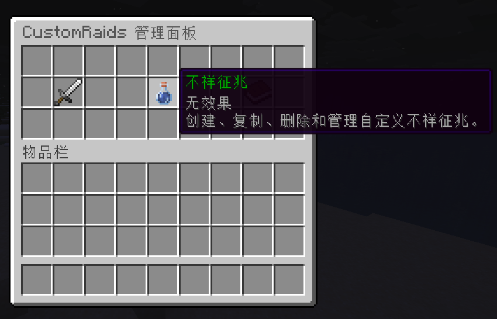

#不祥征兆配置教程

## 使用游戏内 GUI 编辑



使用 `/raids gui` 打开游戏内管理菜单，快速创建 Omen。

## 使用配置文件编辑

### 文件位置

自定义 Omen 配置文件位于 `plugins/CustomRaids/omens/`。

内置示例为 `example_bad_omen.yml`。

### 配置结构

```yaml
# Omen 列表；每个子节点的名称都是唯一的 omen id
# 命令和 PlaceholderAPI 占位符都会使用该 id
omens:
  example_bad_omen:
    # Omen 的彩色显示名
    display_name: "&2Example Bad Omen"

    # 是否允许原版 BAD_OMEN 效果触发此 Omen
    use_vanilla_bad_omen: true

    # 喝牛奶时是否清除玩家的自定义 Omen 状态
    milk_clears_custom_omen: true

    # 触发袭击后是否消耗玩家的自定义 Omen
    consume_custom_omen: true

    # 触发袭击后是否移除玩家的原版 BAD_OMEN 效果
    consume_vanilla_bad_omen: true

    # 玩家获得 Omen 时的提示配置
    obtain_notify:
      # 提示方式：msg、actionbar 或 title
      mode: msg

      # mode 为 msg 时发送的聊天消息
      msg: "&a你获得了 %omen% Lv.%level%"

      # mode 为 actionbar 时显示的 ActionBar 文本
      actionbar: "&a%omen% Lv.%level%"

      # mode 为 title 时显示的主标题和副标题
      title: "&2Omen Obtained"
      subtitle: "&a%omen% Lv.%level%"

      # 标题的淡入、停留和淡出时间，单位均为 tick
      title_fade_in: 5
      title_stay: 40
      title_fade_out: 10

      # 获得 Omen 时播放的可选音效
      # 未配置时使用 config.yml 中的 omen.default_obtain_sound
      sound: { id: "minecraft:entity.experience_orb.pickup", volume: 1.0, pitch: 1.0 }

    # 可由此 Omen 触发的袭击预设；从符合等级范围的条目中按相对权重选择
    presets:
      # preset：袭击预设名
      # weight：相对选择权重
      # min_level / max_level：可选的最低和最高 Omen 等级
      - preset: example_raid
        weight: 100
        min_level: 1
        max_level: 5
```

### 预设选择

触发自定义 Omen 时，插件会根据 Omen 等级和权重选择一个匹配的袭击预设。

### 数据存储

玩家当前的自定义 Omen 状态保存在 `plugins/CustomRaids/omen_state.yml`。
