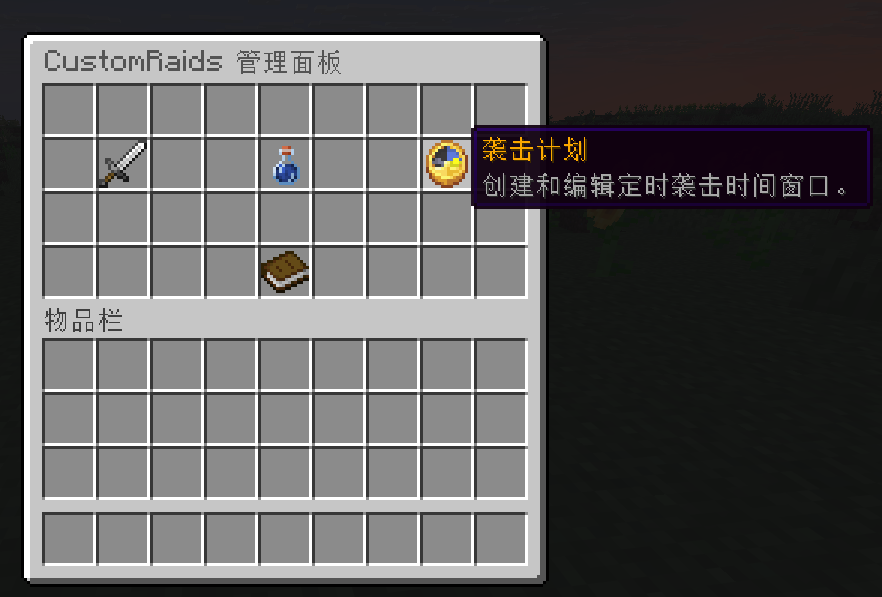

# 定时袭击计划教程

> 此功能为进阶版专属。

## 使用游戏内 GUI 编辑



使用 `/raids gui` 打开游戏内管理菜单，快速创建定时袭击计划。

## 使用配置文件编辑

### 文件位置

定时袭击计划从 `plugins/CustomRaids/raid-plans.yml` 加载。

### 用途

袭击计划用于在指定时间窗口内自动启动配置好的袭击预设。

调度器只会袭击当前有在线玩家停留的领地。没有玩家的领地会被忽略。

例如，将时间窗口设置为每周六 `20:00`～`22:00` 后，如果玩家位于允许袭击的区域，插件会在该区域启动袭击。

### 配置结构及字段说明

```yaml
# 是否启用定时袭击计划
enabled: true

# 调度器检查计划的间隔，单位为秒
check_interval_seconds: 30

# 计划列表；每个计划的 ID 必须唯一
plans:
  saturday_evening:
    # 是否启用此计划
    enabled: false

    # 区域提供器名称，可填写 Custom、Towny、Residence 或 Lands
    provider: "Towny"

    # 执行计划的世界名
    world: "world"

    # 计划启动的袭击预设名
    preset: "example_raid"

    # 计划使用的时区
    # 填写 server 时使用服务器时区，也可填写 Java 时区 id，如 Asia/Shanghai
    timezone: "server"

    # 允许执行计划的星期
    # 支持完整星期名、MON 形式的短名称，以及 1～7 的数字值
    days:
      - SATURDAY

    # 计划的有效时间窗口，格式为 HH:mm
    # 时间窗口可以跨越午夜，例如 22:00～02:00
    time:
      # 窗口开始时间
      start: "20:00"

      # 窗口结束时间
      end: "22:00"

    # 是否限制同一时间窗口内只启动一次
    # true：避免在同一窗口内重复启动；false：每次检查时都允许尝试启动
    once_per_window: true
```

## 常见问题

### 袭击没有启动

- 全局 `enabled` 或计划自身的 `enabled` 为 `false`。
- 时间窗口内没有玩家位于匹配区域。
- `world`、`provider` 或 `preset` 配置错误。
- 目标区域已有进行中的袭击。

### 袭击只触发一次

- 已启用 `once_per_window: true`。
- 等待下一个匹配时间窗口，或将其设置为 `false`。
